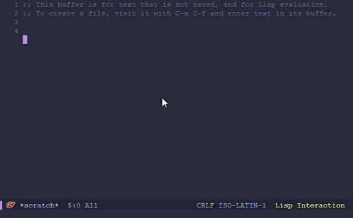
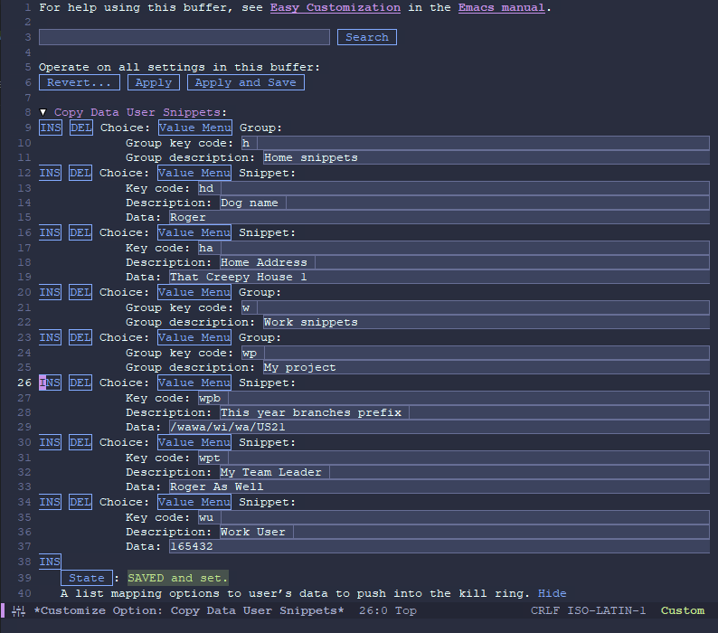
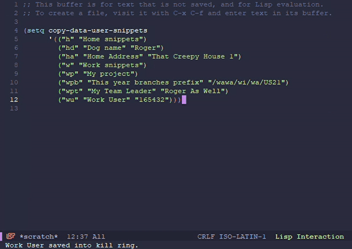

# Copy Data Mode

Copy Data Mode is a tool created for saving time seraching for data
and copying it just for pasting somewhere else.



## Install

Install copy-data-mode by placing `copy-data-mode.el` in
`/path/to/elisp`, a directory of your choice, and adding to your
.emacs file:

```elisp
(add-to-list 'load-path "/path/to/elisp")
(when (require 'copy-data-mode nil t)
  (copy-data-mode)
  (global-set-key (kbd "C-c d") 'copy-data-query)) ;; use whatever key bingding
```

## Usage

First of all, you need to create your backend, your data pool. You can
create your snippets by customizing the `copy-data-user-snippets`:



Or you can set the variable yourself. Here is an example:

```elisp
(setq copy-data-user-snippets
      '(("h" "Home snippets")
	("hd" "Dog name" "Roger")
	("ha" "Home Address" "That Creepy House 1")
	("w" "Work snippets")
	("wp" "My project")
	("wpb" "This year branches prefix" "/wawa/wi/wa/US21")
	("wpt" "My Team Leader" "Roger As Well")
	("wu" "Work User" "165432")))
```

As you can see, you can create groups and place snippets inside those
groups. Of course, you can create snippet belonging to no group as
well. Now, if you want to copy your Work User, you just have to press
`M-x copy-data-query RET wu` and 165432 will be ready to be pasted
anywere you want. You don't have to memorize thouse paths; the echo
area will show you the aviable snippets or groups for each level.



If you want to know more about `copy-data-user-snippets` format, just
run `C-h v copy-data-user-snippets`.

## Customizations

A number of variables can be custimized.

The faces used to display the snippets and groups keys at the echo
area are defined at `copy-data-snippet-key` and `copy-data-group-key`.
You can customize them.

The order used to display the elements in the echo area can be
customized through the `copy-data-query-sort` variable. It accepts any
function that takes two arguments and returns non-`nil` if the first
argument should sort before the second.

There are some functions already defined for this purpose:

- No sorting at all: `copy-data-sort-no`
- Place groups first `copy-data-sort-by-groups`
- Place groups first `copy-data-sort-by-groups`

## License and stuff

Copyright (C) 2021 Felipe Santa Cruz Martínez Alcalá

* Author: Felipe Santa Cruz Martínez Alcalá <fesanmar@gmail.com>
* Maintainer: Felipe Santa Cruz Martínez Alcalá <fesanmar@gmail.com>
* URL: https://github.com/fesanmar/copy-data-mode
* Version: 1.1.0
* Created: 2021-08-19
* Keywords: kill-ring

THIS FILE IS SUBJECT TO CHANGE, AND NOT SUITABLE FOR DISTRIBUTION BY
PACKAGE MANAGERS SUCH AS APT, PKGSRC, MACPORTS, &C.

Copy Data Mode is free software: you can redistribute it and/or
modify it under the terms of the GNU General Public License as
published by the Free Software Foundation, either version 3 of the
License, or (at your option) any later version.

Copy Data Mode is distributed in the hope that it will be useful,
but WITHOUT ANY WARRANTY; without even the implied warranty of
MERCHANTABILITY or FITNESS FOR A PARTICULAR PURPOSE. See the GNU
General Public License for more details.

You should have received a copy of the GNU General Public License
along with Copy Data Mode. If not, see
<http://www.gnu.org/licenses/>.