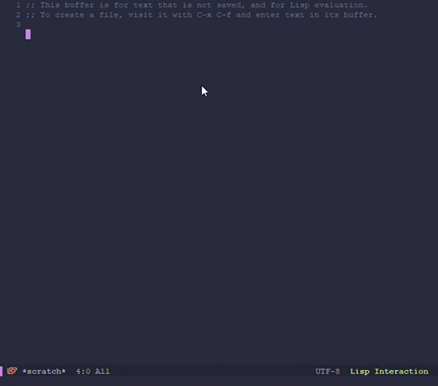

# Copy Data Mode

Copy Data Mode is a tool created for saving time seraching for data
and copying it just for pasting somewhere else.


## Install

Install copy-data-mode by placing `copy-data-mode.el` in
`/path/to/elisp`, a directory of your choice, and adding to your
.emacs file:

```elisp
(add-to-list 'load-path "/path/to/elisp")
(when (require 'copy-data-mode nil t)
  (copy-data-mode)
  (global-set-key (kbd "C-c d") 'copy-data-query)) ;; use whatever key bingding
```

## Usage

First of all, you need to create your backend, your data pool. You can
create your snippets by customizing the `copy-data-user-snippets`
variable:


Or you can set the variable yourself. Here is an example:

```elisp
(setq copy-data-user-snippets
      '(("h" "Home snippets")
	    ("hd" "Dog name" "Roger")
		("ha" "Home Address" "That Creepy House 1")
		("w" "Work snippets")
		("wp" "My project")
		("wpb" "This year branches prefix" "/wawa/wi/wa/US21")
		("wpt" "My Team Leader" "Roger As Well")
		("wu" "Work User" "165432")))
```

As you can see, you can create groups and place snippets inside those
groups. Of course, you can create snippet belonging to no group as
well. Now, if you want to copy your Work User, you just have to press
`M-x copy-data-query RET wu` and 165432 will be ready to be pasted
anywere you want. You don't have to memorize thouse paths; the echo
area will show you the aviable snippets or groups for each level.


If you want to know more about `copy-data-user-snippets` format, just
run `C-h v copy-data-user-snippets`.

Another way, maybe the easiest one, to create yor snippets and group
is [Hot Edit](#Hot-Edit).

## Hot Edit

### What is Hot Edit?

Hot Edit provides an easy and interactive interface that lets you
create, delete and update snippets and groups in an interactive and
easy way.

Hot Edits saves the `copy-data-user-snippets` using Emacs
`customize-save-variable` function. So using Hot Edits means that you
will have a `custom-set-variables` call into your init file, or
wherever file the `custom-file` is pointing at.

### Enabling and using Hot Edit

To use Hot Edit you must first set `copy-data-hot-edit-enable` to a
non-nil value. This can be done by customizing
`copy-data-hot-edit-enable` or by setting the value manually into your
init file.

Then you can call `M-x copy-data-query RET` and move through your
snippets and groups. If you press `+` key, you will be able to create
a new snippet or group inside your current location.

If we have this snippets:

```elisp
(setq copy-data-user-snippets
      '(("h" "Home snippets")
	    ("hd" "Dog name" "Roger")
		("ha" "Home Address" "That Creepy House 1")
		("w" "Work snippets")
		("wp" "My project")
		("wpb" "This year branches prefix" "/wawa/wi/wa/US21")
		("wpt" "My Team Leader" "Roger As Well")
		("wu" "Work User" "165432")))
 ```
 
 We can create a new Snippet inside `Home snippets` by pressing `M-x
 copy-data-user-snippets RET h+` and following the instructions. Let's
 create a snippet with the following data:
 
 - Group: h
 - Key: e
 - Description: Email
 - Email: mymail@mail.com

We must run `copy-data-query` and press:

- `h` (We enter into `Home snippets`)
- `+` to create a new element
- `s` to tell Hot Edit that the new element will be a snippet
- `e` as the new snippet's key
- `Email RET` (the description)
- `mymail@mail.com RET` (the snippet itself)


We have created a new snippet! Now our `copy-data-user-snippets`
variable looks like this:

```elisp
(("h" "Home snippets")
 ("hd" "Dog name" "Roger")
 ("ha" "Home Address" "That Creepy House 1")
 ("w" "Work snippets")
 ("wp" "My project")
 ("wpb" "This year branches prefix" "/wawa/wi/wa/US21")
 ("wpt" "My Team Leader" "Roger As Well")
 ("wu" "Work User" "165432")
 ("he" "Email" "mymail@mail.com"))
```

To edit an element you can press the key defined in
`copy-data-hot-edit-edit-key` (default is `.`) inside the desired
group. Then, just press the key representing the element you want to
edit. Copy Data will ask you to enter the new value of the key, the
description and, in case element isn't a group, the snippet itself. In
all cases, old value is the default value.

For example, lets change the element `("hd" "Dog name" "Roger")` into
`("hd" "Dog name" "Bob")`.



We pressed: 
- `h` to enter the group `Home snippets`
- `.` to tell Copy Data we want to edit and element inside the current group
- `RET` to tell Copy Data we don't want to change the element's key
- `RET` to tell Copy Data we don't want to change the element's definition
- `BobRET` To set the snippet's data to `Bob`.

If you want to edit partially the old value (either on the description
or in the snippet's data), you can press `M-n`. The old text will
appear in the echo area so you can work with it.

## Customizations

A number of variables can be custimized.

In the first place the `copy-data-user-snippets` can be customized.

The faces used to display the snippets and groups keys at the echo
area are defined at `copy-data-snippet-key` and `copy-data-group-key`.
You can customize them.

The order used to display the elements in the echo area can be
customized through the `copy-data-query-sort` variable. It accepts any
function that takes two arguments and returns non-`nil` if the first
argument should sort before the second.

There are some functions already defined for this purpose:

- No sorting at all: `copy-data-sort-no`
- Place groups first `copy-data-sort-by-groups`
- Place groups first `copy-data-sort-by-groups`

## License and stuff

Copyright (C) 2021 Felipe Santa Cruz Martínez Alcalá

* Author: Felipe Santa Cruz Martínez Alcalá <fesanmar@gmail.com>
* Maintainer: Felipe Santa Cruz Martínez Alcalá <fesanmar@gmail.com>
* URL: https://github.com/fesanmar/copy-data-mode
* Version: 1.2.0-SNAPSHOT
* Created: 2021-08-19
* Keywords: kill-ring

THIS FILE IS SUBJECT TO CHANGE, AND NOT SUITABLE FOR DISTRIBUTION BY
PACKAGE MANAGERS SUCH AS APT, PKGSRC, MACPORTS, &C.

Copy Data Mode is free software: you can redistribute it and/or
modify it under the terms of the GNU General Public License as
published by the Free Software Foundation, either version 3 of the
License, or (at your option) any later version.

Copy Data Mode is distributed in the hope that it will be useful,
but WITHOUT ANY WARRANTY; without even the implied warranty of
MERCHANTABILITY or FITNESS FOR A PARTICULAR PURPOSE. See the GNU
General Public License for more details.

You should have received a copy of the GNU General Public License
along with Copy Data Mode. If not, see
<http://www.gnu.org/licenses/>.
